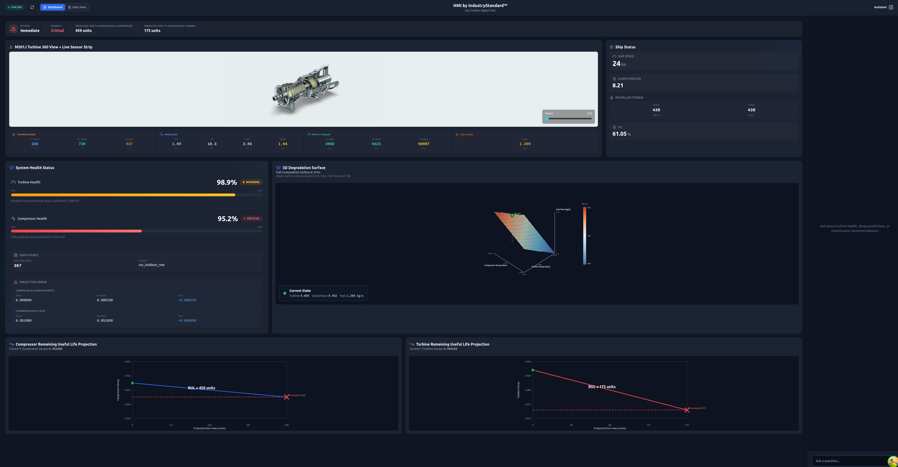

# Digital Twin for Marine Propulsion Predictive Maintenance

This repository contains a group project on condition monitoring and predictive maintenance for a marine gas turbine propulsion system.

The project combines data analysis, machine learning, backend services, and an operator-facing dashboard into a single digital twin prototype. It was developed in the context of the AIS4004 Digital Twins course and focuses on using operational sensor data to estimate component degradation and support maintenance planning.



## Project Scope

The system is organized around three main parts:

- A Python `FastAPI` backend for prediction, sensor analysis, maintenance logic, and HMI endpoints
- A `Next.js` frontend that functions as an operator dashboard / HMI
- A data and modeling pipeline for exploratory analysis, model training, and evaluation

The prototype supports:

- prediction of compressor and turbine decay from operating conditions or sensor inputs
- health-state classification into `healthy`, `warning`, or `critical`
- abnormal sensor analysis
- maintenance recommendation logic
- dashboard visualizations for system condition and degradation trends
- remaining useful life style projections for maintenance planning

## Architecture

### Backend

The backend is implemented in Python using `FastAPI`. It loads the cleaned dataset, builds the selected models, and exposes endpoints for:

- decay prediction
- sensor-based analysis
- maintenance recommendation
- HMI snapshots and visual data
- RUL-related dashboard views

Main backend files:

- `src/main.py`
- `src/service.py`
- `src/schemas.py`

### Frontend / HMI

The frontend is built with `Next.js`, `React`, and `TypeScript`.

The HMI includes:

- health and maintenance summary cards
- degradation visualization
- turbine inspection imagery / 360-style viewer
- chat-style assistant panel
- frontend API routes that bridge the UI to the backend

Frontend application:

- `stitch 2/hmi-app`

### Data and Analysis

The repository also includes:

- cleaned and time-indexed propulsion datasets
- exploratory data analysis outputs
- model comparison metrics
- report and dashboard design artifacts

Relevant folders:

- `Data/EDA`
- `Data/Models`
- `Data/cleaned_data.csv`
- `Data/Time-index-data.csv`

## Model Summary

Several baseline and non-linear regression models were evaluated for the two degradation targets.

Selected models currently used in the backend:

- Compressor decay: `SVR (RBF)`
- Turbine decay: `Random Forest Regressor`

Representative results from the repository artifacts:

- Compressor decay prediction: approximately `R2 = 0.998` with `SVR`
- Turbine decay prediction: approximately `R2 = 0.993` with `Random Forest`

These results should be interpreted in the context of an academic benchmark dataset and a prototype implementation.

## Repository Structure

```text
.
├── Data/                    # Dataset, EDA outputs, report assets, model metrics
├── src/                     # FastAPI backend and prediction/service logic
├── stitch 2/hmi-app/        # Next.js operator dashboard / HMI
├── README.md                # Existing project README
├── README_GITHUB.md         # GitHub-facing overview
├── README_API.md            # Backend endpoint reference
├── openapi.json             # Exported API schema
└── requirements.txt         # Python dependencies
```

## Tech Stack

- Python
- FastAPI
- pandas
- numpy
- scikit-learn
- Pydantic
- Next.js
- React
- TypeScript
- Tailwind CSS
- Zustand
- React Query

## Project Value

This repository demonstrates an end-to-end prototype for a maritime predictive maintenance use case, combining:

- engineering data analysis
- regression model development and evaluation
- API design for technical services
- operator-facing dashboard development
- integration of analytics with maintenance-oriented decision support

## Limitations

This is an academic group project and should be interpreted in that context.

- The dataset is a benchmark naval propulsion dataset, not live vessel telemetry
- Health and RUL logic are simplified for demonstration purposes
- The system is a prototype rather than an operationally validated decision-support tool

## Possible Extensions

Natural next steps for the project would include:

- evaluation on streaming or live telemetry
- time-series forecasting approaches
- uncertainty estimation for predictions
- more detailed fault-diagnosis logic
- deployment as a persistent monitoring service
